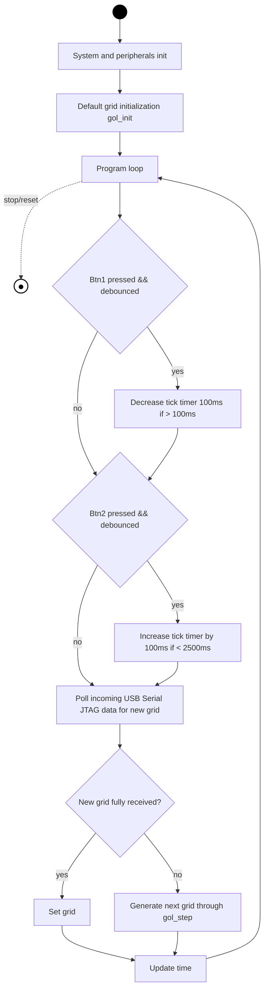
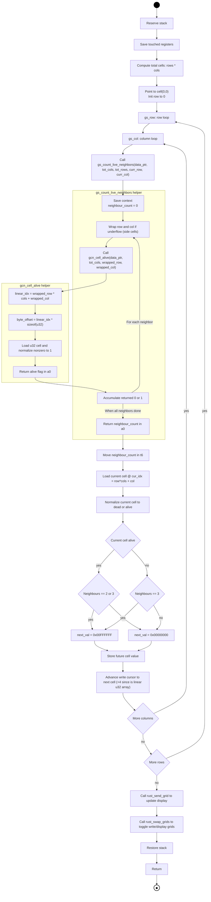
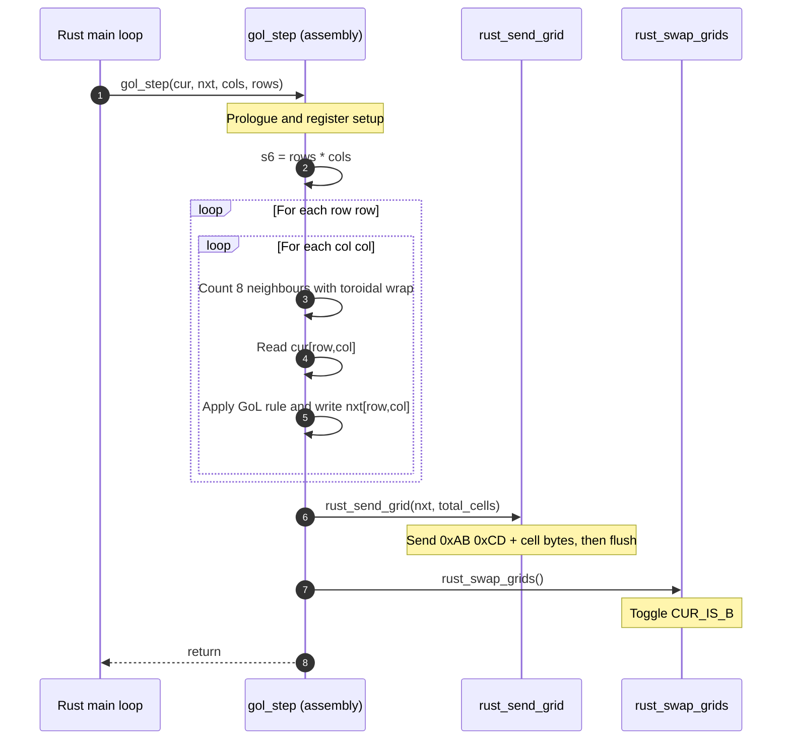

# GoLRS

## gol_step diagrams

### Short flow

```mermaid
flowchart LR
  IN0((●))
  OUT0((●))
  classDef point fill:#000,stroke:#000,color:#000;
  classDef entryPoint fill:#000,stroke:#000,color:#000,stroke-width:2px,font-size:22px,font-weight:bold;
  classDef exitPoint fill:#fff,stroke:#000,color:#000,stroke-width:2px,font-size:22px,font-weight:bold;
  class IN0 entryPoint;
  class OUT0 exitPoint;

  IN0 --> A
  A[Timer gate in main loop] --> B[gol_step cur nxt cols rows]
  B --> C[Count neighbours per cell]
  C --> D[Apply Game of Life rules]
  D --> E[Write next grid]
  E --> F[rust_send_grid nxt total]
  F --> G[rust_swap_grids]
  G --> H[Return to main loop]
  H --> OUT0
```

### Detailed flow

```mermaid
flowchart TD
  IN1((●))
  OUT1((●))
  classDef point fill:#000,stroke:#000,color:#000;
  classDef entryPoint fill:#000,stroke:#000,color:#000,stroke-width:2px,font-size:22px,font-weight:bold;
  classDef exitPoint fill:#fff,stroke:#000,color:#000,stroke-width:2px,font-size:22px,font-weight:bold;
  class IN1 entryPoint;
  class OUT1 exitPoint;

  IN1 --> A
  A[System and peripherals init] --> A1[Default grid initialization gol_init]
  A1 --> A2[Program loop]
  A2 --> B{Btn1 pressed && debounced}
  B -- yes --> B1[Decrease tick timer 100ms if > 100ms]
  B -- no --> B2
  B1 --> B2{Btn2 pressed && debounced}
  B2 -- yes --> B3[Increase tick timer by 100ms if < 2500ms]
  B2 -- no --> B4
  B3 --> B4[Poll incoming USB Serial JTAG data for new grid]
  B4 --> B6{New grid fully received?}
  B6 -- yes --> C[Set grid]
  B6 -- no --> D[Generate next grid through gol_step]
  C --> E[Update time]
  D --> E
  E --> A2
  A2 -. stop/reset .-> OUT1
```

### ASM flow (gol_step)

```mermaid
flowchart TD
  IN2((●))
  OUT2((●))
  classDef point fill:#000,stroke:#000,color:#000;
  classDef entryPoint fill:#000,stroke:#000,color:#000,stroke-width:2px,font-size:22px,font-weight:bold;
  classDef exitPoint fill:#fff,stroke:#000,color:#000,stroke-width:2px,font-size:22px,font-weight:bold;
  class IN2 entryPoint;
  class OUT2 exitPoint;

  IN2 --> A1
  A1[Reserve stack] --> A2[Save touched registers]
  A2 --> B[Compute total cells: rows * cols]
  B --> C["Point to cell(0,0)<br/>Init row to 0"]

  C --> D[gs_row: row loop]
  D --> E[gs_col: column loop]

  E --> F["Call gs_count_live_neighbors(data_ptr, tot_cols, tot_rows, curr_row, curr_col)"]

  subgraph N1[gs_count_live_neighbors helper]
    U1[Save context<br/>neighbour_count = 0] --> U2["Wrap row and col if underflow (side cells)"]
    U2 --> U3["Call gcn_cell_alive(data_ptr, tot_cols, wrapped_row, wrapped_col)"]
    U4[Accumulate returned 0 or 1]
    U4 -- When all neighbors done --> U5[Return neighbour_count in a0]
  end

  subgraph N2[gcn_cell_alive helper]
    V1[linear_idx = wrapped_row * cols + wrapped_col] --> V2["byte_offset = linear_idx * sizeof(u32)"]
    V2 --> V3[Load u32 cell and normalize nonzero to 1]
    V3 --> V4[Return alive flag in a0]
  end

  F --> U1
  U3 --> V1
  V4 --> U4
  U4 -- For each neighbor --> U2
  U5 --> G[Move neighbour_count in t6]

  G --> H1["Load current cell @ cur_idx = row*cols + col"]
  H1 --> H2[Normalize current cell to dead or alive]
  H2 --> I{Current cell alive}
  I -- yes --> J{Neighbours == 2 or 3}
  I -- no --> K{Neighbours == 3}
  J -- yes --> L[next_val = 0x00FFFFFF]
  J -- no --> M[next_val = 0x00000000]
  K -- yes --> L
  K -- no --> M

  L --> N[Store future cell value]
  M --> N
  N --> O["Advance write cursor to next cell (+4 since is linear u32 array)"]

  O --> P{More columns}
  P -- yes --> E
  P -- no --> Q{More rows}
  Q -- yes --> D
  Q -- no --> R[Call rust_send_grid to update display]

  R --> S[Call rust_swap_grids to toggle write/display grids]
  S --> T[Restore stack]
  T --> U[Return]
  U --> OUT2
```

### Sequence diagram

```mermaid
sequenceDiagram
  autonumber
  participant Main as Rust main loop
  participant ASM as gol_step (assembly)
  participant UART as rust_send_grid
  participant Grid as rust_swap_grids

  Main->>ASM: gol_step(cur, nxt, cols, rows)
  Note over ASM: Prologue and register setup
  ASM->>ASM: s6 = rows * cols

  loop For each row row
    loop For each col col
      ASM->>ASM: Count 8 neighbours with toroidal wrap
      ASM->>ASM: Read cur[row,col]
      ASM->>ASM: Apply GoL rule and write nxt[row,col]
    end
  end

  ASM->>UART: rust_send_grid(nxt, total_cells)
  Note over UART: Send 0xAB 0xCD + cell bytes, then flush
  ASM->>Grid: rust_swap_grids()
  Note over Grid: Toggle CUR_IS_B
  ASM-->>Main: return
```
