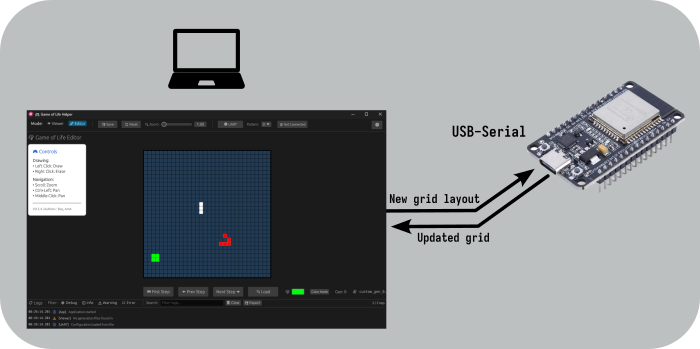

<h1 align="center">
  <br>
  
  <br>
  Game Of Life (GoL) on ESP-RS
  <br>
</h1>

<h4 align="center">Labor Files for CAr Semester Project Game Of Life - <a href="https://isc.hevs.ch/learn/course/view.php?id=26" target="_blank">ISC Learn</a>.</h4>

# Table of contents
<p align="center">
  <a href="#description">Description</a> •
  <a href="#how-to-use">How To Use</a> •
  <a href="#credits">Credits</a> •
  <a href="#license">License</a> •
  <a href="#fund-us-on">Find us on</a>
</p>



## Description
[(Back to top)](#table-of-contents)

The [Game of Life](https://en.wikipedia.org/wiki/Conway%27s_Game_of_Life) has been created by the British mathematician John Conway in 1970.

A grid is composed of cells, each of which can be either alive or dead. The evolution of the grid is based on 4 simple rules applied to each cell based on its neighbors.

This project implements the Game of Life on an ESP-RS board using a dedicated PC app for setting and viewing the grid evolutions. Students implement specific parts of the projects in RV32IM assembly language.

## How To Use
[(Back to top)](#table-of-contents)

Refer to the project documentation on [Github](https://github.com/hei-isc-car/car-docs) directly.

### Launch
The project uses a [justfile]("https://github.com/casey/just") to simplify running commands. Overview of the commands:
```bash
Available recipes:
  all-clippy                       # Lint all Rust crates
  all-fmt                          # Format all Rust crates
  default                          # List all commands
  gol-build                        # Build esp-rs project without flashing
  gol-debug-build                  # Build GoLRS debug-ready firmware for VS Code debugging
  gol-flash                        # Flash esp-rs board
  gol-viewer                       # Run gol-viewer
  info                             # Information about the environment
  run                              # Flash the board and run the viewer
  test port=DEF_PORT baud=DEF_BAUD # Run hardware-in-the-loop oracle tests against board assembly implementation
```

## Credits
[(Back to top)](#table-of-contents)
* BoY
* AmA
* ZaS

## License
[(Back to top)](#table-of-contents)

:copyright: [All rights reserved](LICENSE)

---

## Find us on
> [hevs.ch](https://www.hevs.ch) &nbsp;&middot;&nbsp;
> Facebook [@hessovalais](https://www.facebook.com/hessovalais) &nbsp;&middot;&nbsp;
> Twitter [@hessovalais](https://twitter.com/hessovalais) &nbsp;&middot;&nbsp;
> LinkedIn [HES-SO Valais-Wallis](https://www.linkedin.com/groups/104343/) &nbsp;&middot;&nbsp;
> Youtube [HES-SO Valais-Wallis](https://www.youtube.com/user/HESSOVS)